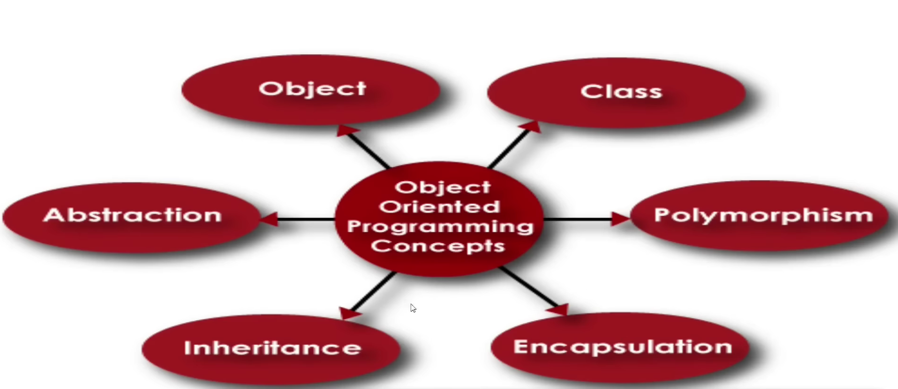
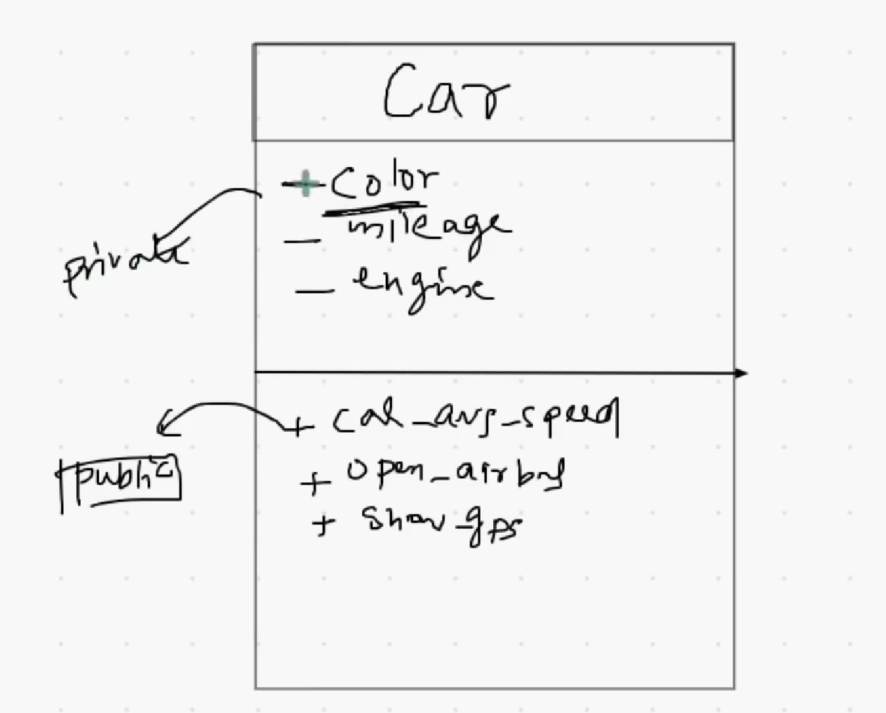
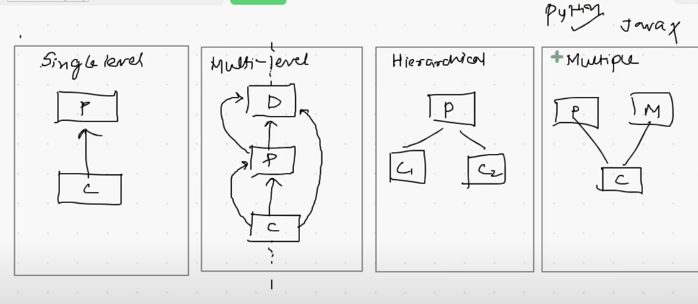

OOP in on shot - CampusX

https://www.youtube.com/watch?v=Mf2RdpEiXjU&t=11539s&ab_channel=CampusX

concept : -

Diagramatic Representation of Class:-

-------------------- Types of Inheritance in Python -----------------

1. Single - Level Inheritance --> one parent - one child inheritance
2. Multi - Level Inheritance --> Child <-- Parent <-- Grandfather and so on
3. Hierachical Inheritance --> one parent - multi child
4. Multiple Inheritance --> multi parent -- one chile (In Java it is not there)
5. Hybrid Inheritance --> Mixture of the above 4 types

